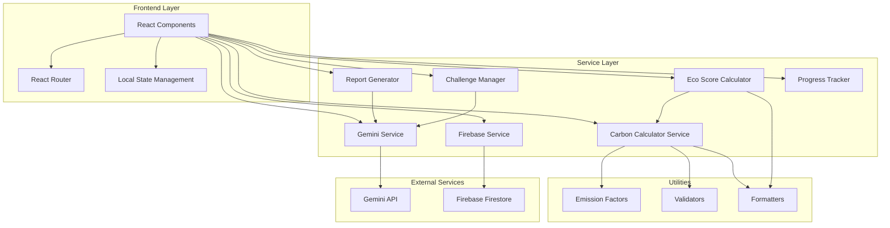

# Design Document - TerraTrack Platform

## Overview

TerraTrack is an intelligent sustainability platform built with React, Vite, and Tailwind CSS that empowers users to understand and reduce their carbon footprint through AI-powered insights. The system provides carbon footprint calculation across five emission categories (Transport, Electricity, Food, Shopping, Water), generates personalized recommendations via the Gemini API, implements gamification through challenges and progress tracking, and produces downloadable sustainability reports.

### Key Capabilities

- **Multi-Category Carbon Calculation**: Scientifically-based emission factor calculations for transport, electricity, food, shopping, and water usage
- **AI-Powered Insights**: Gemini API integration for personalized recommendations, challenge generation, and conversational sustainability guidance
- **Eco Scoring System**: 0-100 scoring with four classification tiers (Green Hero, Eco Friendly, Needs Improvement, High Impact)
- **Interactive Dashboard**: Real-time visualizations using Chart.js/Recharts showing emission breakdowns, trends, and savings
- **Gamification Engine**: Weekly challenges, point-based leveling system, and achievement tracking
- **Report Generation**: Downloadable PDF/text sustainability reports with AI-generated insights
- **Conversational AI**: Context-aware chatbot for sustainability questions

### Design Principles

1. **Pure Business Logic**: Separate pure calculation functions from side-effects (API calls, storage) to enable property-based testing
2. **Defensive Validation**: Validate all user inputs at boundaries with descriptive error messages
3. **Graceful Degradation**: Handle external API failures (Gemini, Firebase) with fallbacks and user-friendly messages
4. **Accessibility First**: WCAG AA compliance through semantic HTML, keyboard navigation, and proper ARIA labels
5. **Performance Budget**: Sub-2-second page loads, sub-1-second calculations, loading states for long operations
6. **Security by Default**: Environment variable-based API key management, input sanitization, type validation

---

## Architecture

### High-Level Architecture



### Architecture Layers

#### 1. Presentation Layer (React Components)

**Responsibilities:**
- User interface rendering with Tailwind CSS
- Form input handling and local validation feedback
- Chart rendering with Chart.js/Recharts
- Navigation and routing
- Loading states and error boundaries

**Key Components:**
- `Navbar.jsx`: Navigation header
- `CarbonCalculator.jsx`: Multi-category activity input form
- `Dashboard.jsx`: Carbon footprint analytics and visualizations
- `EcoScore.jsx`: Score display with classification badge
- `AIRecommendations.jsx`: Personalized recommendation cards
- `Challenges.jsx`: Challenge list with progress tracking
- `Report.jsx`: Report generation interface
- `Footer.jsx`: Footer with app information

#### 2. Service Layer (Business Logic)

**Responsibilities:**
- Pure calculation functions (carbon, eco score)
- External API integration (Gemini, Firebase)
- Data transformation and formatting
- Error handling and retry logic

**Key Services:**
- `carbonCalculator.js`: Core emission calculation logic
- `ecoScoreCalculator.js`: Eco score computation and classification
- `geminiService.js`: Gemini API wrapper with error handling
- `firebaseService.js`: Firestore CRUD operations
- `reportGenerator.js`: PDF/text report creation
- `challengeManager.js`: Challenge generation and tracking
- `progressTracker.js`: Point and level calculations

#### 3. Utilities Layer

**Responsibilities:**
- Emission factor constants
- Input validation rules
- Data formatters
- Type guards

**Key Modules:**
- `emissions.js`: Scientifically-based emission factors
- `validators.js`: Input validation functions
- `formatters.js`: Number and date formatting
- `constants.js`: App-wide constants

### Data Flow Architecture

**User Input → Calculation → Storage → Visualization Flow:**

```
User Input (Form)
  ↓ Validation
Service Layer (Pure Functions)
  ↓ Calculation
Firebase Service (Persistence)
  ↓ Storage
Dashboard Components (Visualization)
  ↓ Charts
User Interface (Display)
```

**AI Recommendation Flow:**

```
User Carbon Data
  ↓
Gemini Service
  ↓ API Request
Gemini API
  ↓ AI Response
Service Layer (Parse & Format)
  ↓
UI Component (Display)
```

---

## Components and Interfaces

### Core Service Interfaces

#### Carbon Calculator Service

```javascript
/**
 * Carbon Calculator Service
 * Pure functions for emission calculations
 */

interface ActivityData {
  transport: TransportData;
  electricity: ElectricityData;
  food: FoodData;
  shopping: ShoppingData;
  water: WaterData;
}

interface TransportData {
  mode: 'car' | 'bus' | 'train' | 'bike' | 'walk' | 'flight';
  distance: number; // kilometers per month
}

interface ElectricityData {
  usage: number; // kWh per month
}

interface FoodData {
  meatConsumption: 'high' | 'medium' | 'low' | 'none'; // frequency per week
  localProduce: boolean;
  foodWaste: 'high' | 'medium' | 'low';
}

interface ShoppingData {
  newClothes: number; // items per month
  electronics: number; // items per year
  recycling: boolean;
}

interface WaterData {
  usage: number; // liters per day
}

interface CarbonFootprint {
  total: number; // kg CO2 per month
  byCategory: {
    transport: number;
    electricity: number;
    food: number;
    shopping: number;
    water: number;
  };
  timestamp: Date;
}

interface ValidationError {
  field: string;
  message: string;
}

/**
 * Calculate total carbon footprint from activity data
 * @param data - User activity data across all categories
 * @returns CarbonFootprint or ValidationError array
 */
function calculateCarbonFootprint(
  data: ActivityData
): CarbonFootprint | ValidationError[];

/**
 * Calculate emissions for transport category
 * @param transport - Transport activity data
 * @returns CO2 in kg
 */
function calculateTransportEmissions(
  transport: TransportData
): number;

/**
 * Calculate emissions for electricity category
 * @param electricity - Electricity usage data
 * @returns CO2 in kg
 */
function calculateElectricityEmissions(
  electricity: ElectricityData
): number;

/**
 * Calculate emissions for food category
 * @param food - Food consumption data
 * @returns CO2 in kg
 */
function calculateFoodEmissions(
  food: FoodData
): number;

/**
 * Calculate emissions for shopping category
 * @param shopping - Shopping habits data
 * @returns CO2 in kg
 */
function calculateShoppingEmissions(
  shopping: ShoppingData
): number;

/**
 * Calculate emissions for water category
 * @param water - Water usage data
 * @returns CO2 in kg
 */
function calculateWaterEmissions(
  water: WaterData
): number;

/**
 * Validate activity data inputs
 * @param data - User activity data
 * @returns Array of validation errors (empty if valid)
 */
function validateActivityData(
  data: ActivityData
): ValidationError[];
```

#### Eco Score Calculator Service

```javascript
/**
 * Eco Score Calculator Service
 * Pure functions for eco score computation
 */

type EcoScoreClassification = 
  | 'Green Hero'    // 90-100
  | 'Eco Friendly'  // 70-89
  | 'Needs Improvement' // 50-69
  | 'High Impact';  // 0-49

interface EcoScore {
  score: number; // 0-100
  classification: EcoScoreClassification;
  message: string;
  color: string; // Hex color for UI display
}

/**
 * Calculate eco score from carbon footprint
 * Score inversely proportional to emissions
 * @param carbonFootprint - Monthly carbon footprint in kg CO2
 * @returns EcoScore object
 */
function calculateEcoScore(
  carbonFootprint: number
): EcoScore;

/**
 * Classify eco score into tier
 * @param score - Numeric score 0-100
 * @returns Classification tier
 */
function classifyEcoScore(
  score: number
): EcoScoreClassification;

/**
 * Get motivational message for score
 * @param classification - Eco score classification
 * @returns User-friendly message
 */
function getScoreMessage(
  classification: EcoScoreClassification
): string;
```

#### Gemini Service

```javascript
/**
 * Gemini Service
 * API integration for AI-powered features
 */

interface GeminiConfig {
  apiKey: string;
  model: string; // e.g., 'gemini-pro'
  timeout: number; // milliseconds
}

interface Recommendation {
  category: string;
  action: string;
  estimatedSavings: number; // kg CO2 per month
  difficulty: 'easy' | 'medium' | 'hard';
  priority: number; // 1-5, 5 = highest
}

interface Challenge {
  id: string;
  title: string;
  description: string;
  criteria: string;
  points: number;
  duration: number; // days
  category: string;
}

interface ChatMessage {
  role: 'user' | 'assistant';
  content: string;
  timestamp: Date;
}

/**
 * Generate personalized recommendations
 * @param carbonFootprint - User's carbon footprint data
 * @returns Array of recommendations or error
 */
async function generateRecommendations(
  carbonFootprint: CarbonFootprint
): Promise<Recommendation[] | Error>;

/**
 * Generate weekly challenges
 * @param userLevel - User's current level
 * @param completedChallenges - Previously completed challenge IDs
 * @returns Array of new challenges or error
 */
async function generateChallenges(
  userLevel: number,
  completedChallenges: string[]
): Promise<Challenge[] | Error>;

/**
 * Chat with AI about sustainability
 * @param messages - Conversation history
 * @param newMessage - User's new question
 * @returns AI response or error
 */
async function chatWithAI(
  messages: ChatMessage[],
  newMessage: string
): Promise<string | Error>;

/**
 * Generate report insights
 * @param carbonFootprint - User's footprint data
 * @param progressData - Historical progress
 * @returns AI-generated report text or error
 */
async function generateReportInsights(
  carbonFootprint: CarbonFootprint,
  progressData: ProgressData
): Promise<string | Error>;

/**
 * Retry API call with exponential backoff
 * @param apiCall - Function to retry
 * @param maxRetries - Maximum retry attempts
 * @returns Result or final error
 */
async function retryWithBackoff<T>(
  apiCall: () => Promise<T>,
  maxRetries: number
): Promise<T | Error>;
```

#### Firebase Service

```javascript
/**
 * Firebase Service
 * Firestore database operations
 */

interface UserProfile {
  userId: string;
  email: string;
  createdAt: Date;
  level: number;
  points: number;
  levelTitle: string;
}

interface ActivityLog {
  id: string;
  userId: string;
  activityData: ActivityData;
  carbonFootprint: CarbonFootprint;
  ecoScore: EcoScore;
  timestamp: Date;
}

interface ChallengeProgress {
  id: string;
  userId: string;
  challengeId: string;
  completed: boolean;
  completedAt?: Date;
  actions: string[]; // Logged sustainability actions
}

/**
 * Save user activity and carbon footprint
 * @param userId - User identifier
 * @param data - Activity and calculation data
 * @returns Success status or error
 */
async function saveActivityLog(
  userId: string,
  data: ActivityLog
): Promise<void | Error>;

/**
 * Retrieve user's historical activity logs
 * @param userId - User identifier
 * @param limit - Maximum number of records
 * @returns Array of activity logs or error
 */
async function getActivityLogs(
  userId: string,
  limit: number
): Promise<ActivityLog[] | Error>;

/**
 * Update user profile
 * @param userId - User identifier
 * @param updates - Partial profile updates
 * @returns Success status or error
 */
async function updateUserProfile(
  userId: string,
  updates: Partial<UserProfile>
): Promise<void | Error>;

/**
 * Save challenge progress
 * @param userId - User identifier
 * @param progress - Challenge progress data
 * @returns Success status or error
 */
async function saveChallengeProgress(
  userId: string,
  progress: ChallengeProgress
): Promise<void | Error>;

/**
 * Get user's challenge history
 * @param userId - User identifier
 * @returns Array of challenge progress or error
 */
async function getChallengeHistory(
  userId: string
): Promise<ChallengeProgress[] | Error>;
```

#### Progress Tracker Service

```javascript
/**
 * Progress Tracker Service
 * Leveling and achievement logic
 */

interface ProgressData {
  totalPoints: number;
  currentLevel: number;
  levelTitle: string;
  pointsToNextLevel: number;
  completedChallenges: number;
  totalCO2Saved: number; // kg
  achievements: Achievement[];
}

interface Achievement {
  id: string;
  title: string;
  description: string;
  unlockedAt: Date;
  icon: string;
}

interface LevelConfig {
  level: number;
  title: string;
  minPoints: number;
}

/**
 * Calculate user level from points
 * @param points - Total accumulated points
 * @returns Level configuration
 */
function calculateLevel(
  points: number
): LevelConfig;

/**
 * Calculate points to next level
 * @param currentPoints - User's current points
 * @returns Points needed for next level
 */
function pointsToNextLevel(
  currentPoints: number
): number;

/**
 * Check and award achievements
 * @param progressData - User's progress data
 * @returns Newly unlocked achievements
 */
function checkAchievements(
  progressData: ProgressData
): Achievement[];

/**
 * Add points for completed challenge
 * @param userId - User identifier
 * @param points - Points to award
 * @returns Updated progress data or error
 */
async function awardPoints(
  userId: string,
  points: number
): Promise<ProgressData | Error>;
```

#### Report Generator Service

```javascript
/**
 * Report Generator Service
 * Create downloadable sustainability reports
 */

interface ReportData {
  userId: string;
  carbonFootprint: CarbonFootprint;
  ecoScore: EcoScore;
  recommendations: Recommendation[];
  progressData: ProgressData;
  comparisonPeriod?: {
    previous: CarbonFootprint;
    percentChange: number;
  };
  generatedAt: Date;
}

/**
 * Generate sustainability report
 * @param userId - User identifier
 * @param format - Output format
 * @returns Report file or error
 */
async function generateReport(
  userId: string,
  format: 'pdf' | 'text'
): Promise<Blob | string | Error>;

/**
 * Format report data for display
 * @param data - Report data
 * @returns Formatted report structure
 */
function formatReportData(
  data: ReportData
): string;

/**
 * Calculate comparison metrics
 * @param current - Current period footprint
 * @param previous - Previous period footprint
 * @returns Comparison statistics
 */
function calculateComparison(
  current: CarbonFootprint,
  previous: CarbonFootprint
): {
  percentChange: number;
  absoluteChange: number;
  improved: boolean;
};
```

---

## Data Models

### Emission Factors

Scientifically-based emission factors used in calculations (sourced from EPA, IPCC standards):

```javascript
/**
 * Emission Factors (kg CO2 per unit)
 */

const EMISSION_FACTORS = {
  transport: {
    car: 0.21,        // kg CO2 per km
    bus: 0.089,       // kg CO2 per km
    train: 0.041,     // kg CO2 per km
    bike: 0,          // kg CO2 per km
    walk: 0,          // kg CO2 per km
    flight: 0.255,    // kg CO2 per km (short-haul average)
  },
  
  electricity: {
    perKWh: 0.475,    // kg CO2 per kWh (grid average)
  },
  
  food: {
    meat: {
      high: 180,      // kg CO2 per month (daily consumption)
      medium: 120,    // kg CO2 per month (4-5x per week)
      low: 60,        // kg CO2 per month (1-2x per week)
      none: 30,       // kg CO2 per month (plant-based)
    },
    localProduce: -15,  // kg CO2 reduction per month
    foodWaste: {
      high: 40,       // kg CO2 per month
      medium: 20,     // kg CO2 per month
      low: 5,         // kg CO2 per month
    },
  },
  
  shopping: {
    clothing: 25,     // kg CO2 per item
    electronics: 200, // kg CO2 per item (amortized yearly)
    recycling: -10,   // kg CO2 reduction per month
  },
  
  water: {
    perLiter: 0.0003, // kg CO2 per liter (treatment + heating)
  },
};

const VALIDATION_RANGES = {
  transport: {
    distance: { min: 0, max: 10000 }, // km per month
  },
  electricity: {
    usage: { min: 0, max: 5000 }, // kWh per month
  },
  shopping: {
    newClothes: { min: 0, max: 100 }, // items per month
    electronics: { min: 0, max: 20 },  // items per year
  },
  water: {
    usage: { min: 0, max: 1000 }, // liters per day
  },
};

const ECO_SCORE_THRESHOLDS = {
  greenHero: { min: 90, max: 100 },
  ecoFriendly: { min: 70, max: 89 },
  needsImprovement: { min: 50, max: 69 },
  highImpact: { min: 0, max: 49 },
};

// Reference footprints for scoring (kg CO2 per month)
const REFERENCE_FOOTPRINTS = {
  excellent: 200,   // Green Hero threshold
  good: 400,        // Eco Friendly threshold
  average: 600,     // Needs Improvement threshold
  poor: 800,        // High Impact threshold
};

const LEVEL_THRESHOLDS: LevelConfig[] = [
  { level: 1, title: 'Green Starter', minPoints: 0 },
  { level: 2, title: 'Eco Learner', minPoints: 100 },
  { level: 3, title: 'Sustainability Advocate', minPoints: 300 },
  { level: 4, title: 'Climate Warrior', minPoints: 600 },
  { level: 5, title: 'Green Guardian', minPoints: 1000 },
  { level: 6, title: 'Earth Hero', minPoints: 1500 },
];
```

### Firestore Data Schema

```javascript
/**
 * Firestore Collections Structure
 */

// Collection: users
{
  userId: string,           // Document ID (Firebase Auth UID)
  email: string,
  createdAt: Timestamp,
  level: number,
  points: number,
  levelTitle: string,
  preferences: {
    notifications: boolean,
    darkMode: boolean,
  }
}

// Collection: activityLogs
{
  id: string,               // Auto-generated document ID
  userId: string,           // Reference to user
  activityData: {
    transport: {...},
    electricity: {...},
    food: {...},
    shopping: {...},
    water: {...},
  },
  carbonFootprint: {
    total: number,
    byCategory: {...},
  },
  ecoScore: {
    score: number,
    classification: string,
  },
  timestamp: Timestamp,
}

// Collection: challenges
{
  id: string,               // Auto-generated document ID
  userId: string,
  challengeId: string,      // Reference to challenge template
  title: string,
  description: string,
  criteria: string,
  points: number,
  duration: number,
  category: string,
  completed: boolean,
  completedAt: Timestamp | null,
  actions: string[],        // Array of logged actions
  createdAt: Timestamp,
}

// Collection: achievements
{
  id: string,               // Auto-generated document ID
  userId: string,
  achievementId: string,
  title: string,
  description: string,
  icon: string,
  unlockedAt: Timestamp,
}
```

---

## Correctness Properties

*A property is a characteristic or behavior that should hold true across all valid executions of a system—essentially, a formal statement about what the system should do. Properties serve as the bridge between human-readable specifications and machine-verifiable correctness guarantees.*

### Property 1: Validation Errors Are Descriptive

*For any* invalid input data submitted to the Carbon_Calculator or form validation, the system SHALL return error messages that specifically identify which field is invalid and why, enabling users to correct their input.

**Validates: Requirements 1.6, 11.3**

### Property 2: Numeric Validation Bounds

*For any* numeric input field (distance, electricity usage, water usage, shopping quantities), the system SHALL reject negative values and values outside realistic ranges defined in VALIDATION_RANGES, ensuring data integrity.

**Validates: Requirements 1.7, 11.2**

### Property 3: Required Field Validation

*For any* form submission with activity data, if required fields are missing or empty, the validation SHALL detect all missing fields and return a complete list of validation errors.

**Validates: Requirements 11.1**

### Property 4: Input Sanitization

*For any* user input containing potentially malicious patterns (SQL injection, XSS), the system SHALL sanitize the input before processing or storage, preventing security vulnerabilities.

**Validates: Requirements 11.4**

### Property 5: Type Validation Integrity

*For any* data being persisted to Firebase, the system SHALL validate that field types match expected schema types (string, number, boolean, timestamp) before storage, preventing type mismatches.

**Validates: Requirements 11.5**

### Property 6: Carbon Calculation Additivity

*For any* complete set of activity data across all five emission categories, the total monthly carbon footprint SHALL equal the sum of individual category emissions (transport + electricity + food + shopping + water), preserving the fundamental invariant of additive emissions.

**Validates: Requirements 2.1**

### Property 7: Decimal Precision Formatting

*For any* calculated carbon footprint value or displayed emission statistic, the system SHALL format numbers to exactly two decimal places, ensuring consistent precision across all user-facing calculations.

**Validates: Requirements 2.4, 6.6**

### Property 8: Calculation Determinism

*For any* identical activity input data, executing the carbon footprint calculation function multiple times SHALL produce identical results, ensuring calculations are pure functions without randomness or side effects.

**Validates: Requirements 2.5**

### Property 9: Eco Score Correctness

*For any* carbon footprint value, the calculated eco score SHALL fall within the range [0, 100], be deterministic (same footprint produces same score), and map to the correct classification tier (Green Hero 90-100, Eco Friendly 70-89, Needs Improvement 50-69, High Impact 0-49).

**Validates: Requirements 3.1, 3.6**

### Property 10: Comparison Calculation Accuracy

*For any* two carbon footprint values (current period and previous period), the system SHALL correctly calculate the absolute difference, percentage change, and improvement direction, enabling accurate progress tracking.

**Validates: Requirements 6.4, 9.5**

### Property 11: Error Handling with Graceful Fallback

*For any* Gemini API error condition (network failure, timeout, invalid response, rate limit), the AI Recommendation Engine SHALL log the error and return a user-friendly fallback message rather than exposing technical error details or crashing.

**Validates: Requirements 4.5**

### Property 12: Recommendation Prioritization

*For any* carbon footprint data with varied category emissions, the AI Recommendation Engine SHALL prioritize recommendations targeting the highest-emitting categories first, ensuring users focus on maximum-impact reductions.

**Validates: Requirements 4.6**

### Property 13: Point Assignment Logic

*For any* challenge with defined difficulty and impact levels, the Challenge Manager SHALL assign point values within valid ranges (e.g., easy: 10-20, medium: 30-50, hard: 60-100), maintaining consistent reward structure.

**Validates: Requirements 7.3**

### Property 14: Level Calculation Consistency

*For any* accumulated point total, the Progress Tracker SHALL calculate the correct user level and level title based on defined thresholds in LEVEL_THRESHOLDS, ensuring consistent progression across all users.

**Validates: Requirements 8.2, 8.3**

### Property 15: Progress Percentage Calculation

*For any* current point total, the Progress Tracker SHALL correctly calculate the percentage progress toward the next level as: `(currentPoints - currentLevelMinPoints) / (nextLevelMinPoints - currentLevelMinPoints) * 100`, providing accurate visual progress indicators.

**Validates: Requirements 8.4**

### Property 16: Report Content Completeness

*For any* sustainability report generation request, the Report Generator SHALL include the user's current carbon footprint summary, identify and highlight the top emission categories, and include AI-generated recommendations, ensuring comprehensive report content.

**Validates: Requirements 9.2, 9.3**

### Property 17: API Key Format Validation

*For any* API key string provided via environment variables, the system SHALL validate the key format matches expected patterns (e.g., Gemini API keys start with specific prefixes) before attempting external API calls, preventing unnecessary failed requests.

**Validates: Requirements 10.5**

### Property 18: User Data Association

*For any* activity log, challenge progress, or achievement data stored in Firebase, the system SHALL associate the data with the correct user identifier, ensuring data isolation and privacy across users.

**Validates: Requirements 13.2**

### Property 19: Database Retry Logic

*For any* failed Firebase write operation, the system SHALL attempt up to three retries with exponential backoff before surfacing the error to the user, improving resilience against transient network failures.

**Validates: Requirements 13.4**

---

## Error Handling

### Error Categories and Strategies

#### 1. Input Validation Errors

**Source:** User form submissions with invalid data

**Handling Strategy:**
- Validate synchronously before submission
- Return field-specific error messages
- Highlight invalid fields in UI
- Preserve valid field values
- Do not submit to backend until all validations pass

**Example Error Response:**
```javascript
{
  valid: false,
  errors: [
    { field: 'transport.distance', message: 'Distance must be between 0 and 10,000 km' },
    { field: 'electricity.usage', message: 'Electricity usage is required' }
  ]
}
```

#### 2. External API Errors (Gemini)

**Source:** Network failures, timeouts, rate limits, invalid responses

**Handling Strategy:**
- Implement retry logic with exponential backoff (3 attempts)
- Set timeout limits (5 seconds for chatbot, 10 seconds for recommendations)
- Log all API errors with request context
- Return graceful fallback messages to users
- Cache successful responses where appropriate

**Fallback Messages:**
- Recommendations: "We're having trouble generating personalized recommendations right now. Try reducing emissions in your highest categories: [top 3 categories]."
- Chatbot: "The AI chatbot is temporarily unavailable. Please try again in a moment."
- Challenges: Use pre-defined challenge templates as fallback

**Example Error Handling:**
```javascript
async function generateRecommendations(footprint) {
  try {
    return await retryWithBackoff(() => geminiAPI.generate(footprint), 3);
  } catch (error) {
    logger.error('Gemini API failed', { error, footprint });
    return getFallbackRecommendations(footprint);
  }
}
```

#### 3. Database Errors (Firebase)

**Source:** Network failures, permission errors, quota exceeded

**Handling Strategy:**
- Retry writes up to 3 times with exponential backoff
- On final failure, store data in browser localStorage
- Display user notification: "Your data has been saved locally and will sync when connection is restored"
- Implement background sync when connection restored
- For read failures, use cached data if available

**Local Storage Schema:**
```javascript
{
  pendingWrites: [
    {
      collection: 'activityLogs',
      data: {...},
      timestamp: '2025-01-15T10:30:00Z',
      retryCount: 0
    }
  ]
}
```

#### 4. Calculation Errors

**Source:** Unexpected input values, edge cases

**Handling Strategy:**
- Use defensive programming with try-catch blocks
- Validate inputs before calculation
- Return sensible defaults for edge cases (e.g., 0 emissions for invalid data)
- Log calculation errors for investigation
- Never crash the UI due to calculation errors

**Example:**
```javascript
function calculateTransportEmissions(transport) {
  try {
    if (!transport || transport.distance < 0) {
      logger.warn('Invalid transport data', transport);
      return 0;
    }
    const factor = EMISSION_FACTORS.transport[transport.mode] || 0;
    return Number((transport.distance * factor).toFixed(2));
  } catch (error) {
    logger.error('Transport calculation error', { error, transport });
    return 0;
  }
}
```

#### 5. Configuration Errors

**Source:** Missing or invalid environment variables

**Handling Strategy:**
- Validate all required environment variables on app startup
- Prevent app initialization if critical keys missing
- Display configuration error page with setup instructions
- Provide .env.example template for reference
- Log configuration errors clearly

**Startup Validation:**
```javascript
function validateConfig() {
  const required = ['VITE_GEMINI_API_KEY', 'VITE_FIREBASE_CONFIG'];
  const missing = required.filter(key => !import.meta.env[key]);
  
  if (missing.length > 0) {
    console.error('Missing required environment variables:', missing);
    throw new Error(`Configuration error: ${missing.join(', ')} not found`);
  }
}
```

### Error Logging Strategy

**Development Environment:**
- Console log all errors with full stack traces
- Display error boundaries in UI
- Show detailed validation errors

**Production Environment:**
- Log errors to external service (e.g., Sentry, LogRocket)
- Display user-friendly error messages
- Include error IDs for user support
- Sanitize sensitive data from logs

---

## Testing Strategy

### Overview

The TerraTrack platform requires comprehensive testing across multiple dimensions:
- **Property-Based Tests**: Verify universal correctness properties with randomized inputs
- **Unit Tests**: Test specific examples, edge cases, and component behavior
- **Integration Tests**: Verify external service integration (Gemini API, Firebase)
- **Accessibility Tests**: Ensure WCAG AA compliance
- **Performance Tests**: Validate response time requirements

### Testing Framework

- **Test Runner**: Vitest (fast, Vite-native)
- **Property-Based Testing**: fast-check library
- **React Component Testing**: React Testing Library
- **API Mocking**: MSW (Mock Service Worker)
- **Accessibility Testing**: jest-axe + manual WCAG review
- **Coverage Tool**: Vitest coverage with c8

### 1. Property-Based Testing

Property-based tests use the fast-check library to generate hundreds of random inputs and verify that correctness properties hold universally.

**Configuration:**
- Minimum 100 iterations per property test
- Each test tagged with: `// Feature: ecotrack-ai-platform, Property {number}: {description}`

**Example Property Test:**

```javascript
import fc from 'fast-check';
import { describe, it, expect } from 'vitest';
import { calculateCarbonFootprint } from '../services/carbonCalculator';

describe('Carbon Calculator Properties', () => {
  // Feature: ecotrack-ai-platform, Property 6: Carbon Calculation Additivity
  it('total emissions equal sum of category emissions', () => {
    fc.assert(
      fc.property(
        fc.record({
          transport: fc.record({
            mode: fc.constantFrom('car', 'bus', 'train', 'bike', 'walk'),
            distance: fc.float({ min: 0, max: 10000 })
          }),
          electricity: fc.record({
            usage: fc.float({ min: 0, max: 5000 })
          }),
          food: fc.record({
            meatConsumption: fc.constantFrom('high', 'medium', 'low', 'none'),
            localProduce: fc.boolean(),
            foodWaste: fc.constantFrom('high', 'medium', 'low')
          }),
          shopping: fc.record({
            newClothes: fc.integer({ min: 0, max: 100 }),
            electronics: fc.integer({ min: 0, max: 20 }),
            recycling: fc.boolean()
          }),
          water: fc.record({
            usage: fc.float({ min: 0, max: 1000 })
          })
        }),
        (activityData) => {
          const result = calculateCarbonFootprint(activityData);
          
          // Property: total = sum of categories
          const categorySum = Object.values(result.byCategory)
            .reduce((sum, val) => sum + val, 0);
          
          expect(Math.abs(result.total - categorySum)).toBeLessThan(0.01);
        }
      ),
      { numRuns: 100 }
    );
  });

  // Feature: ecotrack-ai-platform, Property 8: Calculation Determinism
  it('identical inputs produce identical outputs', () => {
    fc.assert(
      fc.property(
        fc.record({
          transport: fc.record({
            mode: fc.constantFrom('car', 'bus', 'train'),
            distance: fc.float({ min: 0, max: 5000 })
          }),
          electricity: fc.record({ usage: fc.float({ min: 0, max: 2000 }) }),
          food: fc.record({
            meatConsumption: fc.constantFrom('high', 'medium', 'low', 'none'),
            localProduce: fc.boolean(),
            foodWaste: fc.constantFrom('high', 'medium', 'low')
          }),
          shopping: fc.record({
            newClothes: fc.integer({ min: 0, max: 50 }),
            electronics: fc.integer({ min: 0, max: 10 }),
            recycling: fc.boolean()
          }),
          water: fc.record({ usage: fc.float({ min: 0, max: 500 }) })
        }),
        (activityData) => {
          const result1 = calculateCarbonFootprint(activityData);
          const result2 = calculateCarbonFootprint(activityData);
          
          expect(result1.total).toBe(result2.total);
          expect(result1.byCategory).toEqual(result2.byCategory);
        }
      ),
      { numRuns: 100 }
    );
  });

  // Feature: ecotrack-ai-platform, Property 7: Decimal Precision Formatting
  it('all emissions formatted to 2 decimal places', () => {
    fc.assert(
      fc.property(
        fc.record({
          transport: fc.record({
            mode: fc.constantFrom('car', 'bus', 'train', 'flight'),
            distance: fc.float({ min: 0, max: 10000 })
          }),
          electricity: fc.record({ usage: fc.float({ min: 0, max: 5000 }) }),
          food: fc.record({
            meatConsumption: fc.constantFrom('high', 'medium', 'low', 'none'),
            localProduce: fc.boolean(),
            foodWaste: fc.constantFrom('high', 'medium', 'low')
          }),
          shopping: fc.record({
            newClothes: fc.integer({ min: 0, max: 100 }),
            electronics: fc.integer({ min: 0, max: 20 }),
            recycling: fc.boolean()
          }),
          water: fc.record({ usage: fc.float({ min: 0, max: 1000 }) })
        }),
        (activityData) => {
          const result = calculateCarbonFootprint(activityData);
          
          // Check total has 2 decimal places
          expect(result.total.toString()).toMatch(/^\d+\.\d{2}$/);
          
          // Check all categories have 2 decimal places
          Object.values(result.byCategory).forEach(value => {
            expect(value.toString()).toMatch(/^\d+\.\d{2}$/);
          });
        }
      ),
      { numRuns: 100 }
    );
  });
});
```

**Property Test Coverage (19 properties):**

1. ✅ Validation errors are descriptive (Property 1)
2. ✅ Numeric validation bounds (Property 2)
3. ✅ Required field validation (Property 3)
4. ✅ Input sanitization (Property 4)
5. ✅ Type validation integrity (Property 5)
6. ✅ Carbon calculation additivity (Property 6)
7. ✅ Decimal precision formatting (Property 7)
8. ✅ Calculation determinism (Property 8)
9. ✅ Eco score correctness (Property 9)
10. ✅ Comparison calculation accuracy (Property 10)
11. ✅ Error handling with graceful fallback (Property 11)
12. ✅ Recommendation prioritization (Property 12)
13. ✅ Point assignment logic (Property 13)
14. ✅ Level calculation consistency (Property 14)
15. ✅ Progress percentage calculation (Property 15)
16. ✅ Report content completeness (Property 16)
17. ✅ API key format validation (Property 17)
18. ✅ User data association (Property 18)
19. ✅ Database retry logic (Property 19)

### 2. Unit Tests (Example-Based)

Unit tests verify specific scenarios, edge cases, and component behavior with concrete examples.

**Example Unit Tests:**

```javascript
import { describe, it, expect } from 'vitest';
import { calculateEcoScore, classifyEcoScore } from '../services/ecoScoreCalculator';

describe('Eco Score Calculator', () => {
  describe('Score Boundaries', () => {
    it('classifies score 90 as Green Hero', () => {
      const result = calculateEcoScore(200); // Low footprint
      expect(result.classification).toBe('Green Hero');
    });

    it('classifies score 89 as Eco Friendly', () => {
      const result = classifyEcoScore(89);
      expect(result).toBe('Eco Friendly');
    });

    it('classifies score 70 as Eco Friendly (boundary)', () => {
      const result = classifyEcoScore(70);
      expect(result).toBe('Eco Friendly');
    });

    it('classifies score 69 as Needs Improvement', () => {
      const result = classifyEcoScore(69);
      expect(result).toBe('Needs Improvement');
    });

    it('classifies score 50 as Needs Improvement (boundary)', () => {
      const result = classifyEcoScore(50);
      expect(result).toBe('Needs Improvement');
    });

    it('classifies score 49 as High Impact', () => {
      const result = classifyEcoScore(49);
      expect(result).toBe('High Impact');
    });

    it('classifies score 0 as High Impact (minimum)', () => {
      const result = classifyEcoScore(0);
      expect(result).toBe('High Impact');
    });

    it('classifies score 100 as Green Hero (maximum)', () => {
      const result = classifyEcoScore(100);
      expect(result).toBe('Green Hero');
    });
  });

  describe('Edge Cases', () => {
    it('handles zero footprint', () => {
      const result = calculateEcoScore(0);
      expect(result.score).toBe(100);
      expect(result.classification).toBe('Green Hero');
    });

    it('handles very high footprint', () => {
      const result = calculateEcoScore(10000);
      expect(result.score).toBeGreaterThanOrEqual(0);
      expect(result.score).toBeLessThanOrEqual(100);
    });
  });
});
```

**Unit Test Coverage:**
- ✅ Eco score boundary conditions (Requirements 3.2-3.5)
- ✅ Carbon calculator with specific transport modes
- ✅ Validation error message specificity
- ✅ Level calculation thresholds
- ✅ Progress tracker milestones
- ✅ Report formatting logic
- ✅ Challenge point assignment

### 3. Integration Tests

Integration tests verify external service interactions with mocked APIs.

**Gemini API Integration Tests:**

```javascript
import { describe, it, expect, beforeEach, afterEach } from 'vitest';
import { http, HttpResponse } from 'msw';
import { setupServer } from 'msw/node';
import { generateRecommendations } from '../services/geminiService';

const server = setupServer(
  http.post('https://generativelanguage.googleapis.com/v1beta/models/gemini-pro:generateContent', 
    () => {
      return HttpResponse.json({
        candidates: [{
          content: {
            parts: [{
              text: JSON.stringify([
                {
                  category: 'transport',
                  action: 'Use public transit instead of driving',
                  estimatedSavings: 50,
                  difficulty: 'medium',
                  priority: 5
                }
              ])
            }]
          }
        }]
      });
    }
  )
);

beforeEach(() => server.listen());
afterEach(() => server.close());

describe('Gemini Service Integration', () => {
  it('generates recommendations successfully', async () => {
    const footprint = {
      total: 500,
      byCategory: {
        transport: 250,
        electricity: 100,
        food: 100,
        shopping: 30,
        water: 20
      }
    };

    const recommendations = await generateRecommendations(footprint);
    
    expect(Array.isArray(recommendations)).toBe(true);
    expect(recommendations[0]).toHaveProperty('category');
    expect(recommendations[0]).toHaveProperty('action');
    expect(recommendations[0]).toHaveProperty('estimatedSavings');
  });

  it('handles API errors gracefully', async () => {
    server.use(
      http.post('https://generativelanguage.googleapis.com/v1beta/models/gemini-pro:generateContent',
        () => {
          return HttpResponse.error();
        }
      )
    );

    const footprint = { total: 500, byCategory: {} };
    const result = await generateRecommendations(footprint);
    
    expect(result).toBeInstanceOf(Error);
  });

  it('respects timeout limits', async () => {
    server.use(
      http.post('https://generativelanguage.googleapis.com/v1beta/models/gemini-pro:generateContent',
        async () => {
          await new Promise(resolve => setTimeout(resolve, 10000));
          return HttpResponse.json({});
        }
      )
    );

    const footprint = { total: 500, byCategory: {} };
    const result = await generateRecommendations(footprint);
    
    expect(result).toBeInstanceOf(Error);
  }, 6000);
});
```

**Firebase Integration Tests:**

```javascript
import { describe, it, expect } from 'vitest';
import { initializeTestEnvironment } from '@firebase/rules-unit-testing';
import { saveActivityLog, getActivityLogs } from '../services/firebaseService';

describe('Firebase Service Integration', () => {
  it('saves and retrieves activity logs', async () => {
    const userId = 'test-user-123';
    const activityLog = {
      activityData: { /* ... */ },
      carbonFootprint: { total: 500, byCategory: {} },
      ecoScore: { score: 70, classification: 'Eco Friendly' },
      timestamp: new Date()
    };

    await saveActivityLog(userId, activityLog);
    const logs = await getActivityLogs(userId, 10);
    
    expect(logs).toHaveLength(1);
    expect(logs[0].carbonFootprint.total).toBe(500);
  });

  it('retries failed writes', async () => {
    // Mock Firebase to fail twice then succeed
    const userId = 'test-user-123';
    const activityLog = { /* ... */ };
    
    // Implementation should retry up to 3 times
    const result = await saveActivityLog(userId, activityLog);
    expect(result).toBeUndefined(); // Success (no error)
  });
});
```

**Integration Test Coverage:**
- ✅ Gemini API request/response handling
- ✅ Gemini API error handling and fallbacks
- ✅ Firebase data persistence
- ✅ Firebase retry logic
- ✅ Data retrieval and querying

### 4. Accessibility Tests

```javascript
import { render } from '@testing-library/react';
import { axe, toHaveNoViolations } from 'jest-axe';
import CarbonCalculator from '../components/CarbonCalculator';

expect.extend(toHaveNoViolations);

describe('Accessibility', () => {
  it('CarbonCalculator has no accessibility violations', async () => {
    const { container } = render(<CarbonCalculator />);
    const results = await axe(container);
    expect(results).toHaveNoViolations();
  });

  it('all form inputs have labels', () => {
    const { getAllByRole } = render(<CarbonCalculator />);
    const inputs = getAllByRole('textbox');
    
    inputs.forEach(input => {
      expect(input).toHaveAccessibleName();
    });
  });

  it('supports keyboard navigation', () => {
    const { getByRole } = render(<CarbonCalculator />);
    const submitButton = getByRole('button', { name: /calculate/i });
    
    submitButton.focus();
    expect(document.activeElement).toBe(submitButton);
  });
});
```

**Accessibility Test Coverage:**
- ✅ Automated WCAG AA violations (jest-axe)
- ✅ Form label associations
- ✅ Keyboard navigation flows
- ✅ Focus indicators
- ✅ Alt text for charts/visualizations
- 🔧 Manual review: Color contrast ratios with tools

### 5. Performance Tests

```javascript
import { describe, it, expect } from 'vitest';
import { calculateCarbonFootprint } from '../services/carbonCalculator';

describe('Performance Requirements', () => {
  it('calculation completes within 1 second', () => {
    const startTime = performance.now();
    
    const result = calculateCarbonFootprint({
      transport: { mode: 'car', distance: 5000 },
      electricity: { usage: 2000 },
      food: { meatConsumption: 'high', localProduce: false, foodWaste: 'medium' },
      shopping: { newClothes: 50, electronics: 5, recycling: true },
      water: { usage: 500 }
    });
    
    const endTime = performance.now();
    const duration = endTime - startTime;
    
    expect(duration).toBeLessThan(1000);
    expect(result).toBeDefined();
  });
});
```

### Coverage Goals

**Requirement 15: Testing Coverage**

- Carbon Calculator: ≥90% code coverage
- Eco Score Calculator: ≥90% code coverage
- AI Recommendation Engine: Response formatting tests
- Input Validation: All category validation rules
- Integration: End-to-end data flow tests

**Coverage Measurement:**
```bash
npm run test:coverage
```

**Coverage Thresholds (vitest.config.js):**
```javascript
export default {
  test: {
    coverage: {
      provider: 'c8',
      reporter: ['text', 'html', 'lcov'],
      lines: 90,
      functions: 90,
      branches: 85,
      statements: 90,
      include: ['src/services/**', 'src/utils/**'],
      exclude: ['**/*.test.js', '**/*.spec.js']
    }
  }
};
```

### Test Execution Strategy

**Development Workflow:**
```bash
npm run test              # Run all tests
npm run test:watch        # Watch mode during development
npm run test:ui           # Vitest UI for debugging
npm run test:coverage     # Generate coverage report
npm run test:properties   # Run only property-based tests
```

**CI/CD Pipeline:**
1. Run all unit tests (fast feedback)
2. Run property-based tests (100 iterations each)
3. Run integration tests with mocked services
4. Generate coverage reports
5. Run accessibility tests
6. Fail build if coverage < 90% for core services

**Test Organization:**
```
tests/
├── unit/
│   ├── carbonCalculator.test.js
│   ├── ecoScoreCalculator.test.js
│   ├── validators.test.js
│   └── formatters.test.js
├── properties/
│   ├── carbonCalculator.properties.test.js
│   ├── ecoScore.properties.test.js
│   ├── validation.properties.test.js
│   └── progressTracker.properties.test.js
├── integration/
│   ├── geminiService.integration.test.js
│   ├── firebaseService.integration.test.js
│   └── reportGenerator.integration.test.js
├── accessibility/
│   ├── components.a11y.test.js
│   └── navigation.a11y.test.js
└── performance/
    └── calculations.perf.test.js
```

---

## Summary

The TerraTrack platform design provides a comprehensive sustainability tracking solution built on React with AI-powered insights from Gemini API. The architecture separates pure business logic (carbon calculations, eco scoring) from side effects (API calls, database operations), enabling robust property-based testing and maintainable code.

### Key Design Decisions

1. **Pure Function Approach**: Carbon calculation and eco scoring are pure functions, enabling deterministic testing and property-based verification
2. **Graceful Degradation**: External API failures (Gemini, Firebase) degrade gracefully with fallback messages and local storage
3. **Scientific Accuracy**: Emission factors sourced from EPA/IPCC standards with documented references
4. **Accessibility First**: WCAG AA compliance built into component design from the start
5. **Property-Based Testing**: 19 correctness properties with 100+ iterations each ensure comprehensive coverage
6. **Performance Budget**: Clear response time requirements (1s calculations, 2s page loads, 3s dashboard)

### Implementation Priorities

**Phase 1 - Core Functionality:**
- Carbon calculator service with all five categories
- Eco score calculator with classification tiers
- Input validation and error handling
- Firebase integration for data persistence

**Phase 2 - AI Features:**
- Gemini API integration wrapper
- Recommendation generation
- Chatbot implementation
- Report generation with AI insights

**Phase 3 - Gamification:**
- Challenge manager with point system
- Progress tracker with leveling
- Achievement system
- Dashboard visualizations with Chart.js

**Phase 4 - Polish:**
- Accessibility compliance verification
- Performance optimization
- Error boundary refinement
- Comprehensive testing to 90%+ coverage

### Success Metrics

- ✅ 90%+ code coverage on core services
- ✅ All 19 correctness properties pass with 100 iterations
- ✅ Zero WCAG AA violations
- ✅ <1s calculation response time
- ✅ <2s page load time
- ✅ <3s dashboard rendering
- ✅ Graceful handling of all external API failures

